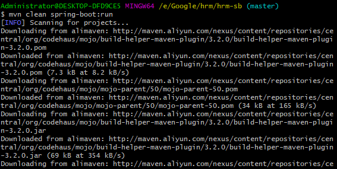
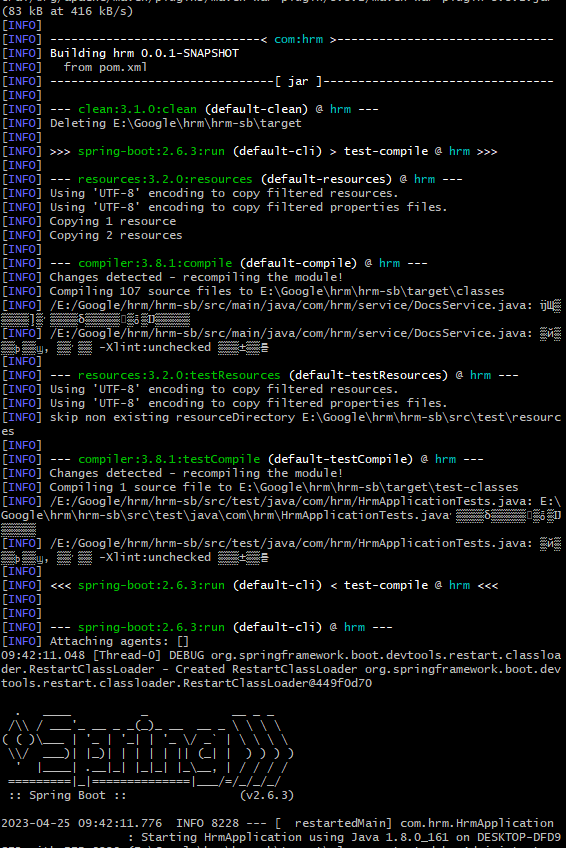
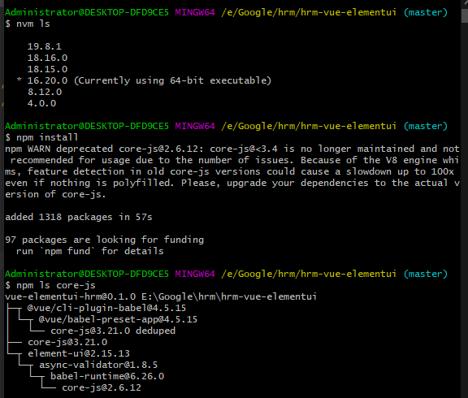
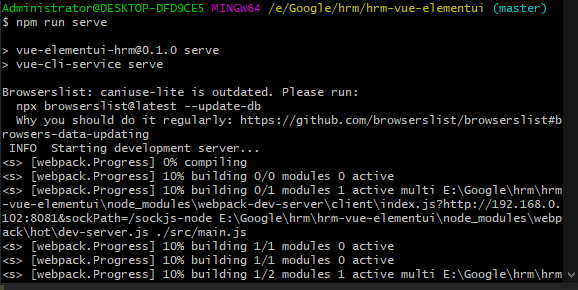
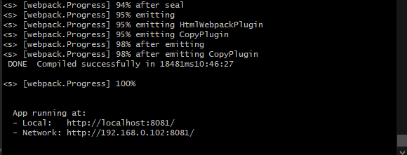
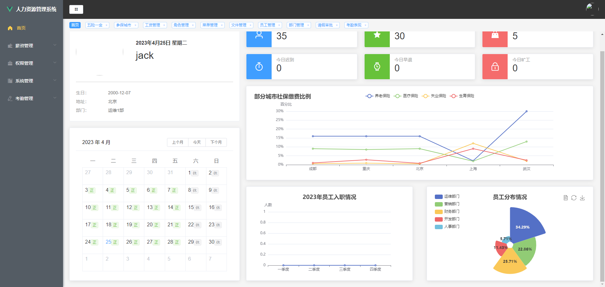
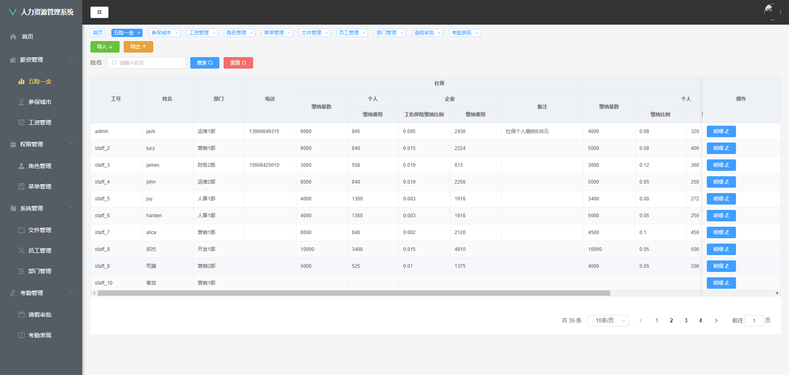
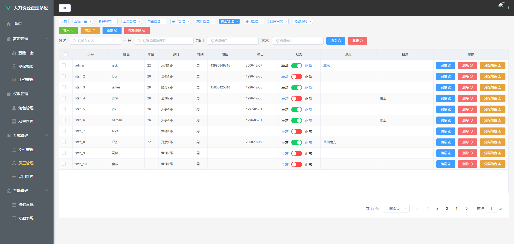

<p align="center"><a href='https://docs.oracle.com/en/java/javase/8'>
</a>
    <a href='https://docs.spring.io/spring-boot/docs/2.6.2-SNAPSHOT/reference/html'>

</a>
    <a href='https://staging-cn.vuejs.org'>

</a><br/>
    <a href='#'></a>
    <a href='#'></a>
    <a href='#'></a>
    <a href='#'></a>
</p>

# 人力资源管理系统

#### 开发环境
Windows

#### 配置环境

| 程序           | 版本        | 说明                       |
|--------------|-----------|--------------------------|
| Jdk          | 1.8.0 161 | Java 开发工具包               |
| Mysql        | 5.5.27    | 关系型数据库                   |
| Apache-maven | 3.9.0     | Java 项目管理和构建工具           |
| Nvm          | 1.10      | Node.js 版本管理器            |
| Node         | 16.20.0   | Node.js JavaScript 运行时环境 |

#### 开发工具

| 工具                       | 版本            | 说明                      |
|--------------------------|---------------|-------------------------|
| IDEA                     | 2022.3.2      | 后前端开发IDE                |
| Git                      | 2.24.1        | 代码托管平台                  |
| Google   Chrome          | 75.0.3770.100 | 浏览器、前端调试工具              |
| Navicat                  | 11.1.13       | 数据库连接工具                 |
| Postman                  | 7.1.0         | 接口测试工具                  |
| VMware   Workstation Pro | 14.1.3        | 虚拟机(未用到或许你会用到)          |
| PowerDesigner            | 15            | 数据库设计工具(未用到或许你会用到)      |
| SQLyog                   | 12.0.3        | 数据库连接工具 (未用到或许你会用到)     |
| Visio                    | 2013          | 时序图、流程图等绘制工具(未用到或许你会用到) |
| ProcessOn                | ——            | 架构图等绘制工具(未用到或许你会用到)     |
| XMind   ZEN              | 9.2.0         | 思维导图绘制工具(未用到或许你会用到)     |
| RedisDesktop             | 0.9.3.817     | redis客户端连接工具(未用到或许你会用到) |

#### 编码规范

- 规范方式：严格遵守阿里编码规约。
- 命名统一：简介最大程度上达到了见名知意。
- 分包明确：层级分明可快速定位到代码位置。
- 注释完整：描述性高大量减少了开发人员的代码阅读工作量。
- 工具规范：使用统一jar包避免出现内容冲突。
- 代码整洁：可读性、维护性高。

#### 包结构

```
 +- file -- 部分图片
 +- hrm-sb -- 后端项目
    +- src
    |   +- main
    |   |    +- java
    |   |    |    +- com
    |   |    |    |    +- hrm
    |   |    |    |    |    +- annotation -- 存放自定义注解的目录
    |   |    |    |    |    +- config -- 存放Spring Boot配置类的目录
    |   |    |    |    |    +- controller -- 控制器类 负责接收和处理HTTP请求
    |   |    |    |    |    +- dto -- 存放数据传输对象的目录
    |   |    |    |    |    +- entity -- 存放实体类的目录
    |   |    |    |    |    +- enums --  存放枚举类型的目录
    |   |    |    |    |    +- exception --  存放自定义异常的目录
    |   |    |    |    |    +- interceptor -- 存放拦截器类的目录
    |   |    |    |    |    +- mapper -- MyBatis框架的数据访问层
    |   |    |    |    |    +- service -- 存放服务接口和实现类的目录
    |   |    |    |    |    +- util -- 工具类
    |   |    |    |    |    +- vo -- 存放值对象的目录
    |   |    |    |    |    +- HrmApplication.java -- 应用程序入口类
    |   |    +- resources
    |   |        +- templates
    |   |        +- application.yml -- 应用程序的配置信息
    |   +- test -- 测试代码
    |  	|	+- java
    |  	|	    +- com
    |  	|	        +- hrm
    |  	|	            +- HrmApplicationTests.java  -- 应用程序单元测试类
    +- target -- Maven建项目时自动生成的目录
    +- .gitignore -- 指定需要 Git 忽略的文件或目录
    +- mvnw -- Maven Wrapper的脚本，作用是为了在开发团队中使用一致的Maven版本，以及简化在新环境中安装Maven的步骤，用于Linux或macOS系统
    +- mvnw.cmd --  Maven Wrapper的脚本，作用是为了在开发团队中使用一致的Maven版本，以及简化在新环境中安装Maven的步骤，用于Windows系统
    +- pom.xml -- 用于声明和管理项目依赖的XML文件
 +- hrm-vue-elementui -- 前端项目
    +- public
        +- favicon.ico -- 网站的图标文件
        +- index.html -- 应用程序的主页面
    +- src
        +- api -- 存放与后端 API 交互的模块
        +- assets -- 静态资源文件 如图片、字体等
        +- components -- Vue 组件
        +- router -- 路由配置
        +- store -- 存放 Vuex 状态管理器的相关代码
        +- utils -- 存放一些公共的工具函数或类
        +- views -- 存放页面级组件
        +- App.vue -- 根组件 协调整个应用程序的视图和管理应用程序的状态
        +- main.js -- 项目的入口文件
    +- .browserslistrc --  定义项目支持的浏览器范围
    +- .editorconfig -- 编辑器的配置文件，用于约定不同编辑器之间的代码风格和格式
    +- .env -- 环境变量配置文件
    +- .eslintrc.js -- ESLint 的配置文件
    +- .gitignore -- 指定需要 Git 忽略的文件或目录
    +- babel.config.js -- Babel 编译器的配置文件
    +- packge.json -- 项目元数据的文件 用于描述 Node.js 应用程序或模块的属性
    +- packge-lock.json -- 锁定当前安装的包的版本号和依赖关系
    +- READE.md -- 项目的相关信息文档
    +- vue.config.js -- Vue CLI 的配置文件，用于配置一些构建和开发环境的相关选项
    +- vue-elementui-hrm.iml --  IntelliJ IDEA 的项目配置文件
    +- yarn.lock -- Yarn 安装包的版本锁定文件
 +- 数据库脚本
 +- LICENSE -- 开源协议
 +- 考勤数据导入模板.xlsx
 +- README.md -- 项目的相关信息文档
```

#### 后端技术栈

| 技术                        | 版本     | 说明                                     |
|---------------------------|--------|----------------------------------------|
| Spring Boot               | 2.6.3  | 项目框架                                   |
| Spring Boot Starter Web   | -      | Web 开发支持                               |
| Spring Boot Starter Test  | -      | 测试支持                                   |
| Lombok                    | -      | 简化 Java 代码                             |
| MySQL Connector-java      | 8.0.17 | MySQL 驱动程序                             |
| MyBatis-Plus              | 3.5.1  | ORM 框架                                 |
| MyBatis-Plus Boot Starter | 3.5.1  | MyBatis-Plus 启动器                       |
| MyBatis-Plus Generator    | 3.5.1  | MyBatis-Plus 代码生成器                     |
| Velocity Engine Core      | 2.3    | 模板引擎                                   |
| SpringFox Swagger2        | 2.9.2  | Swagger2 接口文档生成                        |
| SpringFox Swagger UI      | 2.9.2  | Swagger UI 页面                          |
| Spring Boot DevTools      | -      | 热部署支持                                  |
| java-jwt                  | 3.19.0 | 跨域认证 JWT                               |
| Hutool                    | 5.7.20 | Java 工具类库                              |
| Apache POI                | 5.2.2  | 读写 Microsoft Office 格式文件               |
| Apache POI OOXML Schemas  | 4.1.2  | Microsoft Office 格式文件元素的 XML Schema 定义 |

#### 前端技术栈

| 技术                          | 版本      | 说明                              |
|-----------------------------|---------|---------------------------------|
| axios                       | ^0.25.0 | 基于 Promise 的 HTTP 请求客户端库        |
| cache-loader                | ^4.1.0  | Webpack 缓存加载器                   |
| core-js                     | ^3.6.5  | JavaScript 标准库的模拟、Polyfill      |
| echarts                     | ^5.3.0  | 基于 JavaScript 的开源可视化图表库         |
| element-ui                  | ^2.15.7 | 基于 Vue.js 2.0 的桌面端组件库           |
| less                        | ^4.1.2  | 动态样式语言，用于编写样式                   |
| less-loader                 | ^6.0.0  | Webpack 的 Less 加载器              |
| mockjs                      | ^1.1.0  | 生成随机数据，拦截 Ajax 请求的库             |
| qs                          | ^6.10.3 | 处理 URL 查询字符串的 JavaScript 库      |
| vue                         | ^2.6.11 | 渐进式 JavaScript 框架               |
| vue-router                  | ^3.2.0  | Vue.js 官方的路由管理器                 |
| vuex                        | ^3.6.2  | 状态管理模式和库，为 Vue.js 应用程序提供集中式存储管理 |
| @vue/cli-plugin-babel       | ~4.5.0  | Vue CLI 的 babel 插件              |
| @vue/cli-plugin-eslint      | ~4.5.0  | Vue CLI 的 ESLint 插件             |
| @vue/cli-plugin-router      | ~4.5.0  | Vue CLI 的路由插件                   |
| @vue/cli-service            | ~4.5.0  | Vue CLI 的命令行工具                  |
| @vue/eslint-config-standard | ^5.1.2  | Vue.js 官方的 ESLint 配置            |
| babel-eslint                | ^10.1.0 | 使用 ESLint 检查 Babel 代码的插件        |
| babel-plugin-component      | ^1.1.1  | 按需加载 Element 组件的 Babel 插件       |
| eslint                      | ^6.7.2  | JavaScript 代码检查工具               |
| eslint-plugin-import        | ^2.20.2 | ESLint 的 import 检查插件            |
| eslint-plugin-node          | ^11.1.0 | ESLint 的 Node.js 检查插件           |
| eslint-plugin-promise       | ^4.2.1  | ESLint 的 Promise 检查插件           |
| eslint-plugin-standard      | ^4.0.0  | ESLint 的 JavaScript 标准风格检查插件    |
| eslint-plugin-vue           | ^6.2.2  | ESLint 的 Vue.js 检查插件            |
| sass                        | ^1.49.9 | CSS 预处理器                        |
| vue-template-compiler       | ^2.6.11 | 编译 Vue.js 模板的工具                 |

#### 项目启动
- 1.数据库：mysql5.6在navicat中运行数据库脚本生成对应的数据库表
- 2.后台启动：导入项目，在src/main/resources/application.yml文件里更改数据库名称或数据库密码,进入控制台，到项目所在路径，执行命令：mvn clean spring-boot:run
- 3.前台启动：导入项目，进入控制台，到项目所在路径，执行命令：npm install 后 npm run serve，访问对应的地址进入到登录界面 测试登录 admin/123456











#### 效果展示






